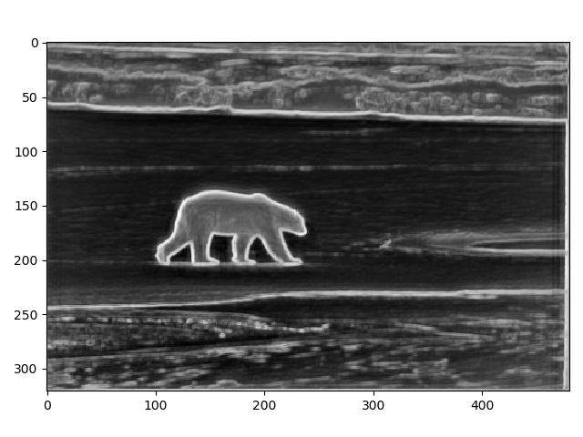
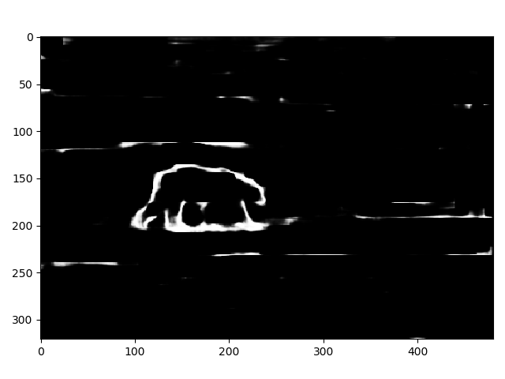

# CS696Project
## Links to some papers
[gPB](https://www2.eecs.berkeley.edu/Research/Projects/CS/vision/grouping/papers/amfm_pami2010.pdf)

[BDCN](https://arxiv.org/pdf/1902.10903.pdf)

[Curriculum Learning](https://ronan.collobert.com/pub/matos/2009_curriculum_icml.pdf)

## Links to BSDS500 and gPB source code
[BSDS500 dataset](http://www.eecs.berkeley.edu/Research/Projects/CS/vision/grouping/BSR/BSR_bsds500.tgz)

[gPB source code](https://www2.eecs.berkeley.edu/Research/Projects/CS/vision/grouping/resources.html#algorithms)

## Link to imagenet pretrained VGG16 pytorch model
[vgg16.pth](https://drive.google.com/open?id=1Nc8HSI1GQ-jzcvbFMqnfKRKMgyOM6xaN) - Download this file and put it under BDCN/caffemodel2pytorch

## How to Run BDCN
- Run command to create data folder:
  ```
  mkdir data && cd data
  ```
- Then download and unzip BSDS500 dataset in that folder.
- Run ```BDCN/mat2jpg.py``` to convert ground-truth mat data to jpg.
- Run ```BDCN/generate_dataset_list.py``` to generate filename list.
- Modify the BSDS500 path in ```BDCN/cfg.py```
- Run ```BDCN/train.py```
## Results
[Results of BDCN with gPB](https://drive.google.com/open?id=11xS31wRNt9fm89NwMF1x4IKAWv8KVFvl)


Example Image 1000 iteration

Example Image 30000 iteration